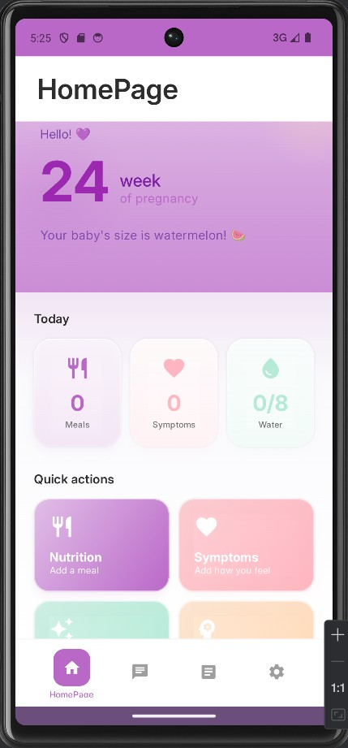
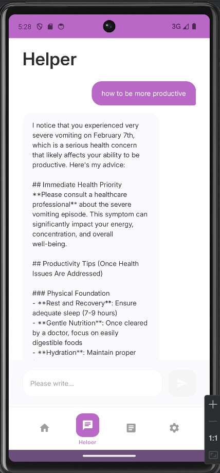
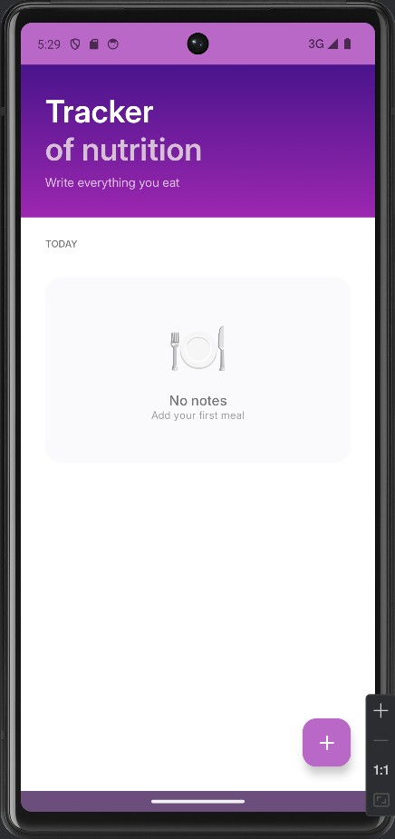
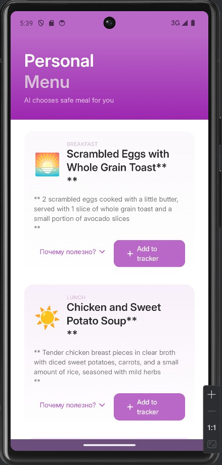

# 🌸 ANAM - AI-Powered Pregnancy Monitoring System

<div align="center">
  
  
  
  
  
  
  **AI-powered preventive pregnancy monitoring system**
  
  [📱 Download APK](#installation) • [📖 Documentation](#documentation) • [🎯 About](#about)
  
</div>

---

## 📋 Table of Contents

- [About the Project](#about)
- [The Problem](#problem)
- [Our Solution](#solution)
- [Key Features](#features)
- [Tech Stack](#tech-stack)
- [Architecture](#architecture)
- [Installation](#installation)
- [Screenshots](#screenshots)
- [Team](#team)
- [Roadmap](#roadmap)
- [Contact](#contact)

---

## 🎯 About the Project <a name="about"></a>

**ANAM** (from Kazakh "Anam" - "my mother") is a comprehensive AI-powered pregnancy monitoring system designed to reduce maternal mortality in Kazakhstan through continuous health tracking and early risk detection.

### 📊 The Problem Statistics:
- **Maternal mortality** increased **3× times** (13.7 → 36.5 per 100,000 births in 2020)
- **99%** of pregnant women attend prenatal care, but only **46%** receive pre-pregnancy counseling
- **7,000+** fetal development issues detected among 50,000 screened women in Kazakhstan

### 💡 Our Mission:
Provide every pregnant woman with access to continuous medical monitoring through AI-powered analysis of daily health data.

---

## 🔍 The Problem <a name="problem"></a>

Pregnancy care in Kazakhstan faces systemic challenges:

1. **❌ No continuous monitoring** between doctor visits (every 2-4 weeks)
2. **❌ Late risk detection** due to infrequent check-ups
3. **❌ Lack of reliable health information** in native languages
4. **❌ No personalized recommendations** for diet and lifestyle
5. **❌ Low compliance** with medical prescriptions

**Result:** Preventable pregnancy complications are not detected in time.

---

## ✨ Our Solution <a name="solution"></a>

ANAM is a **two-component system**:

### 📱 Mobile App (Android) — For Pregnant Women:
- Daily logging: food, symptoms, pain, sleep, vitamins
- AI chat assistant for health questions
- AI-generated personalized meal plans based on symptoms
- Health metrics tracking and pregnancy calendar
- Automatic data sharing with doctors

### 💻 Web Dashboard — For Doctors:
- Detailed clinical analytics for each patient
- AI-powered risk forecasting with specific recommendations
- Trigger Maps (foods → symptoms correlation)
- Timeline of pain episodes and patterns
- Color-coded Risk Boxes (🔴 high, 🟡 medium, 🟢 low)
- Specific prescriptions: "CBC in 7 days", "Ultrasound within 48h"

---

## 🚀 Key Features <a name="features"></a>

### For Patients:

#### 🍎 Food Tracking
- Meal logging with photo upload
- AI-powered food recognition
- Trigger analysis (dairy → bloating 80%)
- Personalized dietary recommendations

#### 💊 Symptom Monitoring
- Nausea: frequency, intensity, timing
- Pain: location, duration, activity correlation
- Swelling, heartburn, constipation
- Sleep quality and disruptions

#### 🤖 AI Assistant
- 24/7 health question answering
- Personalized advice based on health data
- Menu generation based on symptoms and preferences
- Medication and appointment reminders

#### 📊 Health Dashboard
- Visualization of all health metrics
- Week-by-week pregnancy calendar
- Trimester progress tracking
- Complete history of entries

### For Doctors:

#### 📈 Clinical Analytics
- **GI & Toxicosis:**
  - Episodes per day, peak timing
  - Weekly trend analysis
  - Product Trigger Map
  - Risk Box: dehydration at 5+ episodes
  
- **Pain & Uterine Tone:**
  - Frequency, duration, intensity
  - Episode timeline
  - Physical activity correlation
  - 🔴 Hypertonic threat → Ultrasound in 48h
  
- **Sleep & Recovery:**
  - Hours slept, number of awakenings
  - Disruption causes
  - Sleep deficit → cortisol risk
  
- **AI Forecast:**
  - Anemia risk → CBC in 7 days
  - Swelling → urine protein test
  - 40% vitamin compliance → push notifications

#### 👥 Patient Management
- List of all patients with color-coded risk levels
- Filtering by risk level, trimester
- Quick access to detailed patient cards
- Complete visit and prescription history

---

## 🛠 Tech Stack <a name="tech-stack"></a>

### Mobile App (Android)
```
Language:        Kotlin 1.9.0
UI Framework:    Jetpack Compose 1.5.0
Architecture:    MVVM (Model-View-ViewModel)
Navigation:      Compose Navigation
State:           StateFlow, ViewModel
DI:              Hilt / Koin
Database:        Room (SQLite)
Network:         Retrofit + OkHttp
Image Loading:   Coil
Async:           Coroutines + Flow
```

### Web Dashboard
```
Framework:       React / HTML5 + CSS3 + JavaScript
Charts:          Chart.js
Styling:         Custom CSS with Gradients & Glassmorphism
Responsive:      Mobile-first design
```

### Backend & AI
```
API:             RESTful API
AI Model:        Claude API (Anthropic) for chat and analysis
AI Menu Gen:     GPT-based personalized menu generation
Database:        PostgreSQL / Firebase
Analytics:       Custom algorithms for trigger detection
```

---

## 🏗 Architecture <a name="architecture"></a>

### Mobile App Structure
```
app/
├── src/main/java/kz/anam/
│   ├── ui/
│   │   ├── screens/          # Compose UI screens
│   │   │   ├── HomeScreen.kt
│   │   │   ├── FoodLogScreen.kt
│   │   │   ├── SymptomLogScreen.kt
│   │   │   ├── AIChat.kt
│   │   │   └── ...
│   │   ├── components/       # Reusable UI components
│   │   └── theme/           # Colors, Typography, Theme
│   │
│   ├── viewmodels/          # ViewModels for each screen
│   ├── data/
│   │   ├── models/          # Data classes
│   │   ├── repository/      # Data access layer
│   │   └── api/            # API service
│   │
│   ├── navigation/          # Navigation graph
│   └── utils/              # Helper functions
│
└── res/
    ├── font/               # Inter font family
    └── values/            # Strings, colors, dimensions
```

### Design Patterns
- **MVVM** for separation of UI and business logic
- **Repository Pattern** for data source abstraction
- **Single Source of Truth** via StateFlow
- **Dependency Injection** for testability

---

## 📥 Installation <a name="installation"></a>

### Requirements:
- Android 8.0 (API 26) or higher
- ~50 MB free storage
- Internet connection for AI features

### Method 1: Download APK
1. Go to [Releases](https://github.com/yourusername/anam/releases)
2. Download the latest `ANAM-v1.0.apk`
3. Install APK (allow installation from unknown sources)

### Method 2: Build from Source
```bash
# Clone repository
git clone https://github.com/yourusername/anam.git
cd anam

# Open in Android Studio
# Build > Build Bundle(s) / APK(s) > Build APK(s)
```

### For Developers:
```bash
# Install dependencies
./gradlew build

# Run on emulator/device
./gradlew installDebug

# Run tests
./gradlew test
```

---

## 📸 Screenshots <a name="screenshots"></a>

<div align="center">

### Mobile App

| Home Screen | AI Chat | Food Log |
|------------|---------|----------|
|  |  |  |

| Symptom Log | AI Menu | Calendar |
|-------------|---------|----------|
|  |  |  |

### Web Dashboard

| Overview | Patient Detail |
|----------|---------------|
|  |  |

</div>

---

## 👥 Team <a name="team"></a>

<table align="center">
  <tr>
    <td align="center">
      
      <br />
      <b>Dana</b>
      <br />
      <sub>Team Lead & Full-Stack Engineer</sub>
      <br />
      <a href="https://github.com/username">GitHub</a>
    </td>
    <td align="center">
      
      <br />
      <b>Amina</b>
      <br />
      <sub>UI/UX Designer</sub>
      <br />
      <a href="https://github.com/username">GitHub</a>
    </td>
    <td align="center">
      
    <br />
      <b>Aiym</b>
      <br />
      <sub>Researcher</sub>
      <br />
      <a href="https://github.com/username">GitHub</a>
    </td>
  </tr>
</table>

**BloomCare Team** 🌸

---

## 🗺 Roadmap <a name="roadmap"></a>

### ✅ Phase 1: MVP (Completed)
- [x] Android app with core features
- [x] AI chat integration
- [x] Food and symptom logging
- [x] Web dashboard for doctors
- [x] AI-powered risk forecasting

### 🚧 Phase 2: Beta Testing (Current)
- [ ] Testing with 50-100 pregnant women
- [ ] Integration with 3-5 clinics in Almaty
- [ ] User feedback collection and UX improvements
- [ ] AI model optimization

### 🔮 Phase 3: Scale (Q3 2026)
- [ ] Google Play Store launch
- [ ] Wearable device integration (smartwatches)
- [ ] Multi-language support (Kazakh, Russian, English)
- [ ] Expansion to other Kazakhstan cities
- [ ] Partnership with Ministry of Healthcare

### 🌟 Future Vision
- [ ] iOS version
- [ ] Telemedicine: video consultations with doctors
- [ ] EMR (Electronic Medical Records) integration
- [ ] Expansion to CIS countries
- [ ] Predictive model for preterm birth

---

## 📊 Impact Goals

**By end of 2026:**
- 👥 **10,000+** active users
- 🏥 **50+** partner clinics
- 📈 **46% → 80%+** improvement in pre-pregnancy counseling rates
- ❤️ **20%** reduction in maternal mortality in cities of presence

---

## 🤝 Contributing

We welcome community contributions! Here's how you can help:

1. 🐛 **Report bugs** via [Issues](https://github.com/yourusername/anam/issues)
2. 💡 **Suggest features** via [Discussions](https://github.com/yourusername/anam/discussions)
3. 🔧 **Submit Pull Requests** with improvements
4. 📖 **Improve documentation**
5. ⭐ **Star the repository!**

### Guidelines:
- Follow existing code style
- Add tests for new features
- Update documentation
- Write clear commit messages

---

## 📄 License

This project is licensed under the [MIT License](LICENSE).

---

## 📞 Contact <a name="contact"></a>

**BloomCare Team**

- 📧 Email: dyergaliyeva.08@gmail.com
- 💼 LinkedIn: [Anam](https://linkedin.com/company/anamapp)
  

---

## 🙏 Acknowledgments

Special thanks to:
- **Anthropic** for Claude API
- Open-source community for tools and libraries

---

## 📚 Documentation

- [API Documentation](docs/API.md)
- [User Guide](docs/USER_GUIDE.md)
- [Doctor's Manual](docs/DOCTOR_MANUAL.md)
- [Contributing Guide](CONTRIBUTING.md)
- [Code of Conduct](CODE_OF_CONDUCT.md)

---

<div align="center">

### 🌸 Made with ❤️ by BloomCare Team

**ANAM** - Your pregnancy in safe hands 🤰💜

[](https://github.com/yourusername/anam/stargazers)
[](https://github.com/yourusername/anam/network/members)
[](https://github.com/yourusername/anam/issues)

**[⬆ Back to Top](#-anam---ai-powered-pregnancy-monitoring-system)**

</div>
